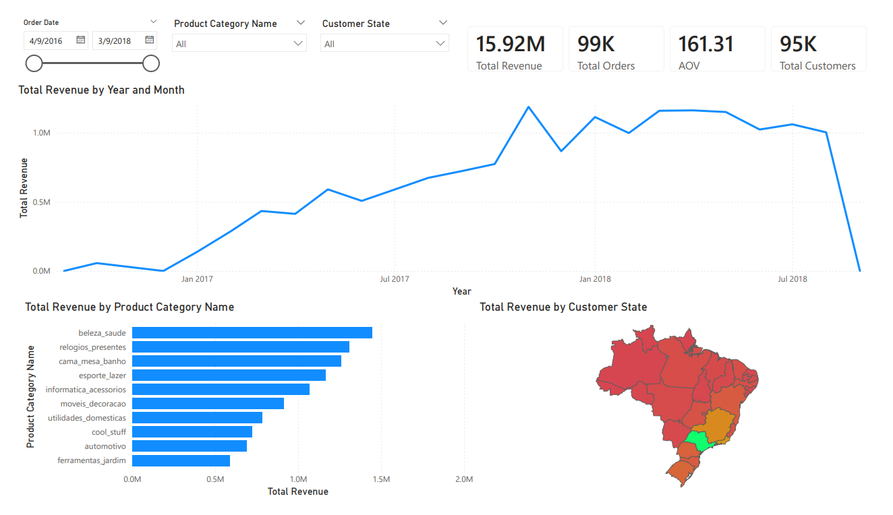
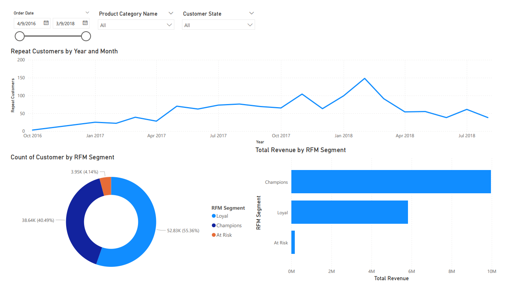
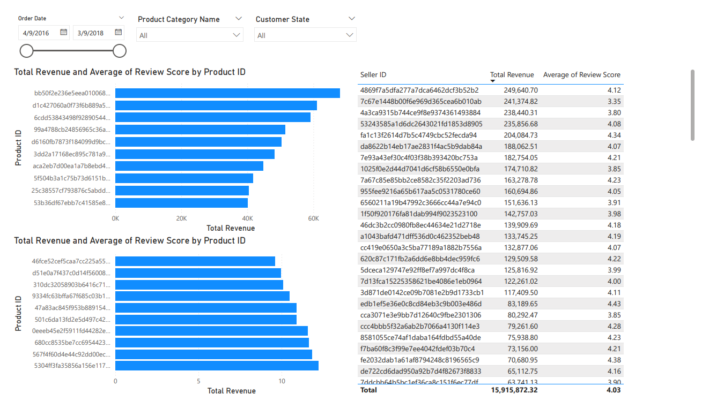
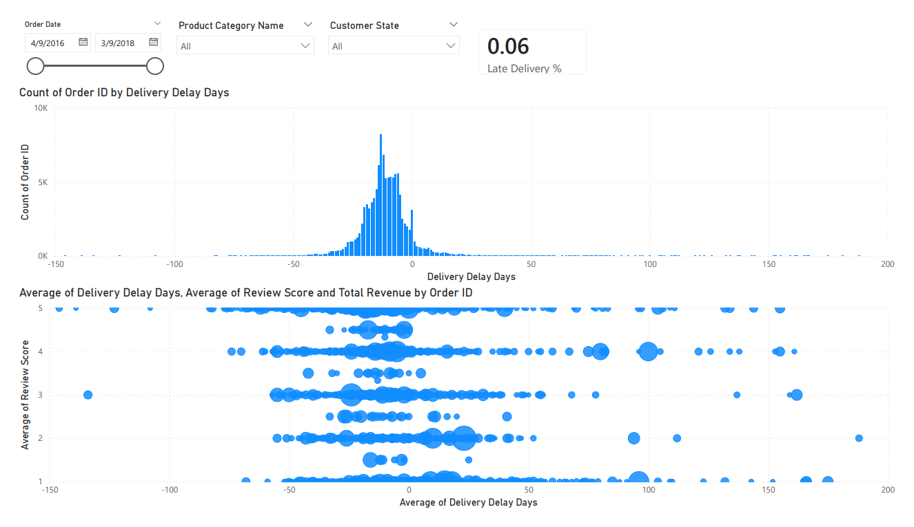

# E-Commerce-Sales-Customer-Analytics-SQL-Power-BI-
## Project Summary
This project analyzes an e-commerce transactional dataset to uncover insights related to sales performance, customer behavior, product demand, and delivery efficiency.

SQL was used to perform data validation, data modeling, and business analysis. Key analyses include calculating total revenue, monthly revenue trends, average order value (AOV), revenue by product category, repeat purchase rate, late delivery rate, and the relationship between delivery delays and customer review scores.

Customer behavior was further analyzed using RFM (Recency, Frequency, Monetary) segmentation. An RFM table was created and customers were scored using the NTILE function to classify them into different value segments.

Additional analyses include monthly order trends, category growth patterns, top-performing products, and seller performance.

Power BI was used to build an interactive dashboard that visualizes key business metrics such as total revenue, total orders, AOV, total customers, revenue by category, geographic sales distribution, repeat customer trends, RFM segmentation results, product performance, seller rankings, delivery delay distribution, and the relationship between delivery delays and customer satisfaction.

This project demonstrates common tasks performed by data analysts, including data preparation, SQL-based analysis, KPI development, customer segmentation, and business-focused dashboard creation.

## Business Problem
E-commerce companies rely heavily on data to monitor sales performance, understand customer behavior, and improve operational efficiency. However, large transactional datasets often contain complex relationships between customers, orders, products, sellers, and delivery processes.

The goal of this project is to analyze e-commerce data to answer key business questions such as:

• What are the main drivers of revenue growth?
• Which product categories generate the most sales?
• Which customers contribute the most revenue?
• How frequently do customers return to make additional purchases?
• Which products and sellers perform best?
• How does delivery performance impact customer satisfaction?

By combining SQL-based analysis with interactive Power BI dashboards, this project aims to transform raw transactional data into actionable insights that can support better business decision-making.

## Dataset Description

### Overview
This project utilizes the **Brazilian E-Commerce Public Dataset by Olist**. It contains real-world data from 100k+ orders placed between 2016 and 2018 across multiple marketplaces in Brazil.

The dataset provides a 360-degree view of an e-commerce ecosystem, covering customer behavior, seller performance, logistics, and product reviews.

[Download Project Dataset](Dataset/Dataset.zip)

---

### Dataset Tables
<details>
<summary>View Table Details (Customers, Orders, Products, etc.)</summary>

#### **customers**

| Column | Description |
| :--- | :--- |
| `customer_id` | Unique identifier for each order customer |
| `customer_unique_id` | Unique identifier for a customer across multiple orders |
| `customer_zip_code_prefix` | First 5 digits of customer zip code |
| `customer_city` | Customer city |
| `customer_state` | Customer state |

#### **geolocation**

| Column | Description |
| :--- | :--- |
| `geolocation_zip_code_prefix` | Zip code prefix |
| `geolocation_lat` | Latitude |
| `geolocation_lng` | Longitude |
| `geolocation_city` | City |
| `geolocation_state` | State |

#### **orders**

| Column | Description |
| :--- | :--- |
| `order_id` | Unique order identifier |
| `customer_id` | Reference to customer |
| `order_status` | Order status |
| `order_purchase_timestamp` | Purchase timestamp |
| `order_approved_at` | Payment approval timestamp |
| `order_delivered_carrier_date` | Date delivered to carrier |
| `order_delivered_customer_date` | Date delivered to customer |
| `order_estimated_delivery_date` | Estimated delivery date |

#### **order_items**

| Column | Description |
| :--- | :--- |
| `order_id` | Order identifier |
| `order_item_id` | Item number within the order |
| `product_id` | Product identifier |
| `seller_id` | Seller identifier |
| `shipping_limit_date` | Shipping deadline |
| `price` | Product price |
| `freight_value` | Shipping cost |

#### **order_payments**

| Column | Description |
| :--- | :--- |
| `order_id` | Order identifier |
| `payment_sequential` | Payment sequence number |
| `payment_type` | Payment method (Credit card, Boleto, etc.) |
| `payment_installments` | Number of installments |
| `payment_value` | Total payment amount |

#### **order_reviews**

| Column | Description |
| :--- | :--- |
| `review_id` | Review identifier |
| `order_id` | Order identifier |
| `review_score` | Customer rating (1–5) |
| `review_comment_title` | Review title |
| `review_comment_message` | Review message |
| `review_creation_date` | Date review created |
| `review_answer_timestamp` | Timestamp when review was answered |

#### **products**

| Column | Description |
| :--- | :--- |
| `product_id` | Product identifier |
| `product_category_name` | Product category |
| `product_name_lenght` | Length of product name |
| `product_description_lenght` | Length of product description |
| `product_photos_qty` | Number of product photos |
| `product_weight_g` | Product weight (grams) |
| `product_length_cm` | Product length (cm) |
| `product_height_cm` | Product height (cm) |
| `product_width_cm` | Product width (cm) |

#### **sellers**

| Column | Description |
| :--- | :--- |
| `seller_id` | Seller identifier |
| `seller_zip_code_prefix` | Seller zip code prefix |
| `seller_city` | Seller city |
| `seller_state` | Seller state |

#### **product_category_name_translation**

| Column | Description |
| :--- | :--- |
| `product_category_name` | Original Portuguese category |
| `product_category_name_english` | English translation |

</details>

---

### Data Model

The dataset follows a relational structure centered around the **orders** table, which serves as the central hub linking customers, items, payments, and reviews.

#### Key Relationships

*   **Orders**: `orders.customer_id` → `customers.customer_id`
*   **Order Details**: 
    *   `order_items.order_id` → `orders.order_id`
    *   `order_items.product_id` → `products.product_id`
    *   `order_items.seller_id` → `sellers.seller_id`
*   **Payments**: `order_payments.order_id` → `orders.order_id`
*   **Reviews**: `order_reviews.order_id` → `orders.order_id`
*   **Customer Location**: `customers.customer_zip_code_prefix` → `geolocation.geolocation_zip_code_prefix`
*   **Seller Location**: `sellers.seller_zip_code_prefix` → `geolocation.geolocation_zip_code_prefix`
*   **Product Categories**: `products.product_category_name` → `product_category_name_translation.product_category_name`


#### Central Fact Table
The `orders` table acts as the **central fact table**, connecting customer demographics, transaction details, product data, and seller information. 

This schema enables deep-dive analysis into:
*   **Customer Behavior**: Purchasing patterns and frequency.
*   **Seller Performance**: Revenue generation and fulfillment.
*   **Product Insights**: Category-level sales and trends.
*   **Logistics**: Delivery performance and estimated vs. actual arrival times.
*   **Finance**: Payment method preferences and installment trends.
*   **Geography**: Sales distribution across Brazilian states.

## SQL Code Explanation
The full SQL script is available for download to view the implementation details.
[Download SQL Code](SQL/Brazilian_E-Commerce_Public_Dataset_by_Olist_SQL.pgsql)

### Data Cleaning & Preparation
To improve the data structure and reduce redundancy, several cleaned tables were created before performing analysis. The goal was to simplify the schema, remove unnecessary columns, and ensure that location information is stored in a single place.

#### Geolocation Table Cleaning
The original `geolocation` table contains latitude and longitude coordinates, which create duplicate rows for the same zip code prefix. Since geographic coordinates are not required for this analysis, they were removed.

A new table was created that keeps only the zip code prefix, city, and state. Aggregation was used to select one valid city and state for each zip code prefix.
```
-- Create a new table and remove latitude and longitude
CREATE TABLE geolocation_cleaned AS
SELECT 
    geolocation_zip_code_prefix,
    -- Using MAX selects one valid city/state if duplicates exist
    MAX(geolocation_city) AS city,
    MAX(geolocation_state) AS state
FROM geolocation
GROUP BY geolocation_zip_code_prefix;
```

#### Customers Table Cleaning
The `customers` table originally contained `customer_city` and `customer_state`. Since this information already exists in the `geolocation` table, these columns were removed to avoid redundancy.

Location information can be retrieved by joining the table using `customer_zip_code_prefix`.

```
-- Create a new table remove customer_city and customer_state
CREATE TABLE customers_cleaned AS 
SELECT 
    customer_id,
    customer_unique_id,
    customer_zip_code_prefix
FROM customers;
```

#### Sellers Table Cleaning
Similarly, the `sellers` table also contained `seller_city` and `seller_state`. These columns were removed because seller location can be determined using the `seller_zip_code_prefix` through the `geolocation_cleaned` table.

```
-- Create the new cleaned seller table remove seller_city and seller_state
CREATE TABLE sellers_cleaned AS
SELECT 
    seller_id,
    seller_zip_code_prefix
FROM sellers;
```

### Defining Primary Keys
After completing the data cleaning step, primary keys were defined for each table to ensure entity integrity and enable reliable table relationships during analysis.

For tables that already contained a unique identifier, that column was assigned as the primary key.
For tables without a guaranteed unique column, a new auto-incrementing `SERIAL` column was created and used as the primary key.

This ensures that every record in the dataset can be uniquely identified and improves the reliability of joins when performing SQL analysis.

```
-- Set primary key for tables with existing unique identifiers
ALTER TABLE orders
ADD PRIMARY KEY (order_id);

ALTER TABLE products
ADD PRIMARY KEY (product_id);

ALTER TABLE product_category_name_translation
ADD PRIMARY KEY (product_category_name);

ALTER TABLE geolocation_cleaned 
ADD PRIMARY KEY (geolocation_zip_code_prefix);

ALTER TABLE customers_cleaned
ADD PRIMARY KEY (customer_id);

ALTER TABLE sellers_cleaned 
ADD PRIMARY KEY (seller_id);

-- Add surrogate primary keys for tables without a unique column
ALTER TABLE order_reviews
ADD COLUMN order_review_id SERIAL PRIMARY KEY;

ALTER TABLE order_items
ADD COLUMN order_items_serial_id SERIAL PRIMARY KEY;

ALTER TABLE order_payments
ADD COLUMN order_payments_id SERIAL PRIMARY KEY;
```

### Defining Foreign Key Relationships
After defining primary keys for each table, foreign key constraints were added to establish relationships between tables based on the dataset schema.

Foreign keys help maintain referential integrity by ensuring that values in related tables correspond to valid records in the parent table. This structure allows reliable joins between tables and supports accurate analytical queries.

The dataset follows a relational structure centered around the `orders` table, which links customer information, order details, payments, reviews, products, and sellers. Additionally, location information is connected through the `geolocation_cleaned` table using zip code prefixes.

```
-- Add reference to create relationship between each table

-- Orders → Customers
ALTER TABLE orders
ADD CONSTRAINT fk_orders_customer
FOREIGN KEY (customer_id) REFERENCES customers_cleaned(customer_id);

-- Order Items → Orders
ALTER TABLE order_items
ADD CONSTRAINT fk_items_orders
FOREIGN KEY (order_id) REFERENCES orders(order_id);

-- Order Items → Products
ALTER TABLE order_items
ADD CONSTRAINT fk_items_products
FOREIGN KEY (product_id) REFERENCES products(product_id);

-- Order Items → Sellers
ALTER TABLE order_items
ADD CONSTRAINT fk_items_sellers
FOREIGN KEY (seller_id) REFERENCES sellers_cleaned(seller_id);

-- Order Payments → Orders
ALTER TABLE order_payments
ADD CONSTRAINT fk_payments_orders
FOREIGN KEY (order_id) REFERENCES orders(order_id);

-- Order Reviews → Orders
ALTER TABLE order_reviews
ADD CONSTRAINT fk_reviews_orders
FOREIGN KEY (order_id) REFERENCES orders(order_id);

-- Fill in missing zip code and set city and state as unknown
INSERT INTO geolocation_cleaned (geolocation_zip_code_prefix, city, state)
SELECT DISTINCT c.customer_zip_code_prefix, 'Unknown', 'Unknown'
FROM customers_cleaned c
LEFT JOIN geolocation_cleaned g ON c.customer_zip_code_prefix = g.geolocation_zip_code_prefix
WHERE g.geolocation_zip_code_prefix IS NULL;

INSERT INTO geolocation_cleaned (geolocation_zip_code_prefix, city, state)
SELECT DISTINCT s.seller_zip_code_prefix, 'Unknown', 'Unknown'
FROM sellers_cleaned s
LEFT JOIN geolocation_cleaned g ON s.seller_zip_code_prefix = g.geolocation_zip_code_prefix
WHERE g.geolocation_zip_code_prefix IS NULL;

-- customers to geolocation
ALTER TABLE customers_cleaned
ADD CONSTRAINT fk_customer_geo
FOREIGN KEY (customer_zip_code_prefix) REFERENCES geolocation_cleaned(geolocation_zip_code_prefix);

-- sellers to geolocation
ALTER TABLE sellers_cleaned
ADD CONSTRAINT fk_seller_geo
FOREIGN KEY (seller_zip_code_prefix) 
REFERENCES geolocation_cleaned(geolocation_zip_code_prefix);
```

#### Relationship Summary
The foreign key constraints establish the following relationships across the dataset:
| Parent Table        | Child Table       | Relationship                             |
| ------------------- | ----------------- | ---------------------------------------- |
| customers_cleaned   | orders            | A customer can place multiple orders     |
| orders              | order_items       | An order can contain multiple products   |
| products            | order_items       | A product can appear in multiple orders  |
| sellers_cleaned     | order_items       | A seller can sell multiple products      |
| orders              | order_payments    | An order can have one or more payments   |
| orders              | order_reviews     | An order can receive a customer review   |
| geolocation_cleaned | customers_cleaned | Customer location determined by zip code |
| geolocation_cleaned | sellers_cleaned   | Seller location determined by zip code   |

#### Handling Missing Geolocation Data
During the process of creating foreign key relationships, it was found that some zip code prefixes in the `customers_cleaned` and `sellers_cleaned` tables did not exist in the `geolocation_cleaned` table.

Since `customers_cleaned` and `sellers_cleaned` reference `geolocation_cleaned` through foreign keys, these missing values would cause referential integrity violations when establishing the relationships.

To resolve this issue, new records were inserted into `geolocation_cleaned` for the missing zip code prefixes. For these records, the `city` and `state` fields were temporarily filled with the value "Unknown" to indicate that the location information is not available in the original dataset.

### Data Quality Check : Handling Missing Values
Before performing any analysis, a data quality check was conducted to identify missing (`NULL`) values across all tables in the dataset. Missing values can lead to inaccurate calculations, incorrect aggregations, or misleading analytical results, so they must be addressed before further analysis.

The following SQL queries were used to detect the number of `NULL` values in each column.
```
-- Check null value
/* 1. ORDER_ITEMS */
SELECT
    COUNT(*) - COUNT(order_id) AS null_order_id,
    COUNT(*) - COUNT(order_item_id) AS null_order_item,
    COUNT(*) - COUNT(product_id) AS null_product_id,
    COUNT(*) - COUNT(seller_id) AS null_seller_id,
    COUNT(*) - COUNT(shipping_limit_date) AS null_shipping_date,
    COUNT(*) - COUNT(price) AS null_price,
    COUNT(*) - COUNT(freight_value) AS null_freight
FROM order_items;

/* 2. ORDER_PAYMENTS */
SELECT
    COUNT(*) - COUNT(order_id) AS null_order_id,
    COUNT(*) - COUNT(payment_sequential) AS null_payment_seq,
    COUNT(*) - COUNT(payment_type) AS null_payment_type,
    COUNT(*) - COUNT(payment_installments) AS null_installments,
    COUNT(*) - COUNT(payment_value) AS null_value
FROM order_payments;

/* 3. ORDER_REVIEWS */
SELECT
    COUNT(*) - COUNT(review_id) AS null_review_id,
    COUNT(*) - COUNT(order_id) AS null_order_id,
    COUNT(*) - COUNT(review_score) AS null_score,
    COUNT(*) - COUNT(review_comment_title) AS null_title,
    COUNT(*) - COUNT(review_comment_message) AS null_message,
    COUNT(*) - COUNT(review_creation_date) AS null_creation_date,
    COUNT(*) - COUNT(review_answer_timestamp) AS null_answer_time
FROM order_reviews;

/* 4. ORDERS */
SELECT
    COUNT(*) - COUNT(order_id) AS null_order_id,
    COUNT(*) - COUNT(customer_id) AS null_customer_id,
    COUNT(*) - COUNT(order_status) AS null_status,
    COUNT(*) - COUNT(order_purchase_timestamp) AS null_purchase_time,
    COUNT(*) - COUNT(order_approved_at) AS null_approved,
    COUNT(*) - COUNT(order_delivered_carrier_date) AS null_carrier_date,
    COUNT(*) - COUNT(order_delivered_customer_date) AS null_customer_date,
    COUNT(*) - COUNT(order_estimated_delivery_date) AS null_estimated_date
FROM orders
WHERE order_status = 'delivered';

-- Create view to filter delivered and not null value
CREATE VIEW orders_cleaned AS
SELECT *
FROM orders
WHERE order_status = 'delivered'
  AND order_delivered_customer_date IS NOT NULL
  AND order_delivered_carrier_date IS NOT NULL
  AND order_approved_at IS NOT NULL;

/* 4. ORDERS_CLEANED */
SELECT
    COUNT(*) - COUNT(order_id) AS null_order_id,
    COUNT(*) - COUNT(customer_id) AS null_customer_id,
    COUNT(*) - COUNT(order_status) AS null_status,
    COUNT(*) - COUNT(order_purchase_timestamp) AS null_purchase_time,
    COUNT(*) - COUNT(order_approved_at) AS null_approved,
    COUNT(*) - COUNT(order_delivered_carrier_date) AS null_carrier_date,
    COUNT(*) - COUNT(order_delivered_customer_date) AS null_customer_date,
    COUNT(*) - COUNT(order_estimated_delivery_date) AS null_estimated_date
FROM orders_cleaned
WHERE order_status = 'delivered';

/* 5. PRODUCTS */
SELECT
    COUNT(*) - COUNT(product_id) AS null_id,
    COUNT(*) - COUNT(product_category_name) AS null_category,
    COUNT(*) - COUNT(product_name_lenght) AS null_name_len,
    COUNT(*) - COUNT(product_description_lenght) AS null_desc_len,
    COUNT(*) - COUNT(product_photos_qty) AS null_photos,
    COUNT(*) - COUNT(product_weight_g) AS null_weight,
    COUNT(*) - COUNT(product_length_cm) AS null_length,
    COUNT(*) - COUNT(product_height_cm) AS null_height,
    COUNT(*) - COUNT(product_width_cm) AS null_width
FROM products;

-- Create new view named products_cleaned, replace null product_category_name to others,
-- replace null integer value to 0
CREATE VIEW products_cleaned AS
SELECT 
    product_id,
    COALESCE(product_category_name, 'others') AS product_category_name,
    COALESCE(product_name_lenght, 0) AS product_name_lenght,
    COALESCE(product_description_lenght, 0) AS product_description_lenght,
    COALESCE(product_photos_qty, 0) AS product_photos_qty,
    COALESCE(product_weight_g, 0) AS product_weight_g,
    COALESCE(product_length_cm, 0) AS product_length_cm,
    COALESCE(product_height_cm, 0) AS product_height_cm,
    COALESCE(product_width_cm, 0) AS product_width_cm
FROM products;

/* 5. PRODUCTS_CLEANED */
SELECT
    COUNT(*) - COUNT(product_id) AS null_id,
    COUNT(*) - COUNT(product_category_name) AS null_category,
    COUNT(*) - COUNT(product_name_lenght) AS null_name_len,
    COUNT(*) - COUNT(product_description_lenght) AS null_desc_len,
    COUNT(*) - COUNT(product_photos_qty) AS null_photos,
    COUNT(*) - COUNT(product_weight_g) AS null_weight,
    COUNT(*) - COUNT(product_length_cm) AS null_length,
    COUNT(*) - COUNT(product_height_cm) AS null_height,
    COUNT(*) - COUNT(product_width_cm) AS null_width
FROM products_cleaned;

/* 6. PRODUCT_CATEGORY_NAME_TRANSLATION */
SELECT
    COUNT(*) - COUNT(product_category_name) AS null_name,
    COUNT(*) - COUNT(product_category_name_english) AS null_english
FROM product_category_name_translation;

/* 7. CUSTOMERS_CLEANED */
SELECT
    COUNT(*) - COUNT(customer_id) AS null_id,
    COUNT(*) - COUNT(customer_unique_id) AS null_unique_id,
    COUNT(*) - COUNT(customer_zip_code_prefix) AS null_zip
FROM customers_cleaned;

/* 8. GEOLOCATION_CLEANED */
SELECT
    COUNT(*) - COUNT(geolocation_zip_code_prefix) AS null_zip,
    COUNT(*) - COUNT(city) AS null_city,
    COUNT(*) - COUNT(state) AS null_state
FROM geolocation_cleaned;

/* 9. SELLERS_CLEANED */
SELECT
    COUNT(*) - COUNT(seller_id) AS null_id,
    COUNT(*) - COUNT(seller_zip_code_prefix) AS null_zip
FROM sellers_cleaned;
```

#### Orders Data Cleaning
The data quality check revealed that some records in the `orders` table contain missing values in delivery-related timestamps.

Since this project focuses on analyzing completed transactions and delivery performance, only successfully delivered orders with complete delivery information were retained.

A cleaned analytical view called `orders_cleaned` was created to filter these records.

```
CREATE VIEW orders_cleaned AS
SELECT *
FROM orders
WHERE order_status = 'delivered'
  AND order_delivered_customer_date IS NOT NULL
  AND order_delivered_carrier_date IS NOT NULL
  AND order_approved_at IS NOT NULL;
```

#### Products Data Cleaning
The data quality check also identified missing values in the `products` table, particularly in:

- `product_category_name`

- product dimension attributes

- product description-related fields

To standardize the dataset:

- Missing product category names were replaced with `"others"`

- Missing numeric attributes were replaced with 0

A cleaned analytical view called products_cleaned was created using the COALESCE() function.

```
CREATE VIEW products_cleaned AS
SELECT 
    product_id,
    COALESCE(product_category_name, 'others') AS product_category_name,
    COALESCE(product_name_lenght, 0) AS product_name_lenght,
    COALESCE(product_description_lenght, 0) AS product_description_lenght,
    COALESCE(product_photos_qty, 0) AS product_photos_qty,
    COALESCE(product_weight_g, 0) AS product_weight_g,
    COALESCE(product_length_cm, 0) AS product_length_cm,
    COALESCE(product_height_cm, 0) AS product_height_cm,
    COALESCE(product_width_cm, 0) AS product_width_cm
FROM products;
```

### Data Quality Check: Abnormal Price Values
To ensure data accuracy, a validation check was performed on the `order_items` table to identify any invalid or abnormal product prices.

Since product prices should always be positive values, the query below checks for records where the price is less than or equal to zero, which may indicate data entry errors or corrupted records.

```
-- Check abnormal price
SELECT *
FROM order_items
WHERE price <= 0;
```

### Creating The Fact Table For Analysis
To simplify analytical queries and prepare the dataset for visualization, a fact table view called `fact_sales` was created.

This view consolidates data from multiple tables, including orders, order items, products, customers, reviews, and geolocation, into a single analytical dataset. The fact table serves as the central dataset for SQL analysis and Power BI dashboards.

The view also includes several derived fields to support business analysis, such as total transaction value and delivery delay days.

#### Key Transformations
The `fact_sales` view performs the following transformations:

- Combines transactional data from order items and orders

- Adds customer information and geographic location

- Includes product category details

- Incorporates customer review scores

- Calculates total transaction value (`price + freight_value`)

- Calculates delivery delay days by comparing the actual delivery date with the estimated delivery date

These transformations create a denormalized analytical dataset, making it easier to perform queries and build visualizations.

```
-- Create fact_sales, and create delivery_delay_days
CREATE VIEW fact_sales AS
SELECT 
    oi.order_id,
    o.order_purchase_timestamp::date AS order_date,
    o.customer_id,
    c.customer_unique_id,
    g.city AS customer_city,
    g.state AS customer_state,
    oi.product_id,
    oi.seller_id,
    oi.price,
    oi.freight_value,
    (oi.price + oi.freight_value) AS total_value,
    r.review_score,
    EXTRACT(DAY FROM (o.order_delivered_customer_date - o.order_estimated_delivery_date))::INT AS delivery_delay_days,
    pc.product_category_name
FROM order_items oi
LEFT JOIN orders o ON oi.order_id = o.order_id
LEFT JOIN order_reviews r ON oi.order_id = r.order_id
LEFT JOIN products_cleaned pc ON oi.product_id = pc.product_id
LEFT JOIN customers_cleaned c ON o.customer_id = c.customer_id

-- Join to Geolocation using the zip code from the customer table
LEFT JOIN (
    SELECT DISTINCT 
        geolocation_zip_code_prefix, 
        city, 
        state 
    FROM geolocation_cleaned
) g ON c.customer_zip_code_prefix = g.geolocation_zip_code_prefix;
```

#### Purpose Of The Fact Table
The `fact_sales` view acts as the central dataset for analysis, enabling efficient exploration of:

- Sales and revenue performance

- Customer purchasing behavior

- Product category performance

- Geographic sales distribution

- Delivery performance

- Customer satisfaction based on review scores

This fact table was also used as the primary data source for the Power BI dashboard, allowing efficient data modeling and visualization.

### Total Revenue Analysis
This query calculates the total revenue generated from all orders in the dataset.
The `total_value` column represents the combined value of product price and freight cost for each order item in the `fact_sales` table.

```
SELECT SUM(total_value) AS total_revenue
FROM fact_sales;
```

#### Result
| Total Revenue       |
| ------------------- |
| 15,915,872.32       |

#### Insight
The platform generated a total revenue of 15.9 million from all completed orders in the dataset.
This metric provides a high-level overview of overall sales performance and serves as the baseline for further analysis such as monthly revenue trends, product category performance, and customer purchasing behavior.

### Monthly Revenue Trend
This query calculates the total revenue generated each month by aggregating the `total_value` from the `fact_sales` table.

The `DATE_TRUNC('month', order_date)` function is used to group all orders into their respective months, allowing us to analyze revenue trends over time.

```
SELECT 
    DATE_TRUNC('month', order_date) AS month,
    SUM(total_value) AS revenue
FROM fact_sales
GROUP BY month
ORDER BY month;
```

#### Result
| ID | Month | Revenue |
|:---|:---|:---|
| 1 | 2016-09-01 | 354.75 |
| 2 | 2016-10-01 | 56989.66 |
| 3 | 2016-12-01 | 19.62 |
| 4 | 2017-01-01 | 138160.22 |
| 5 | 2017-02-01 | 287698.56 |
| 6 | 2017-03-01 | 434044.94 |
| 7 | 2017-04-01 | 413387.27 |
| 8 | 2017-05-01 | 590516.91 |
| 9 | 2017-06-01 | 507123.25 |
| 10 | 2017-07-01 | 588966.63 |
| 11 | 2017-08-01 | 673795.98 |
| 12 | 2017-09-01 | 723299.96 |
| 13 | 2017-10-01 | 774005.04 |
| 14 | 2017-11-01 | 1187779.95 |
| 15 | 2017-12-01 | 866838.54 |
| 16 | 2018-01-01 | 1113929.01 |
| 17 | 2018-02-01 | 998137.75 |
| 18 | 2018-03-01 | 1159663.98 |
| 19 | 2018-04-01 | 1162227.22 |
| 20 | 2018-05-01 | 1150474.33 |
| 21 | 2018-06-01 | 1023674.47 |
| 22 | 2018-07-01 | 1061204.65 |
| 23 | 2018-08-01 | 1003413.17 |
| 24 | 2018-09-01 | 166.46 |

#### Insight
The revenue trend shows significant growth throughout 2017, indicating increasing platform adoption and sales volume. Revenue reached a major peak in November 2017 (~1.19M), which may be driven by seasonal shopping events such as Black Friday promotions.

In 2018, monthly revenue remained relatively stable around 1.0M–1.16M, suggesting the platform had reached a more mature and consistent sales level.

The unusually low revenue in September 2016 and September 2018 likely occurs because the dataset contains partial data for those months.

### Average Order Value (AOV)
This query calculates the Average Order Value (AOV), which represents the average amount spent per order on the platform.

The metric is calculated by dividing the total revenue (`SUM(total_value)`) by the number of unique orders (`COUNT(DISTINCT order_id)`). Using `DISTINCT order_id` ensures that each order is counted only once, even if it contains multiple items.

```
SELECT 
    SUM(total_value) / COUNT(DISTINCT order_id) AS avg_order_value
FROM fact_sales;
```

#### Result
| Average Order Value       |
| ------------------------- |
| 161.31                    |

#### Insight
The analysis shows that the average order value is approximately 161.31 per order. This indicates the typical spending amount customers make in a single transaction on the platform.

AOV is an important metric for evaluating customer purchasing behavior and sales efficiency. Increasing AOV can significantly improve overall revenue without needing to acquire more customers. Businesses often improve AOV through strategies such as product bundling, cross-selling, or offering free shipping thresholds.

### Revenue by Product Category (Top 5 & Bottom 5)
This analysis identifies the highest-performing and lowest-performing product categories based on total revenue.

Two queries were used:

- The first query retrieves the Top 5 categories generating the highest revenue.

- The second query retrieves the Bottom 5 categories with the lowest revenue.

This helps highlight which product categories contribute most to the platform's sales and which categories generate minimal revenue.

```
-- Top 5 Revenue by Category
SELECT 
    product_category_name,
    SUM(total_value) AS Top_5_Revenue
FROM fact_sales
GROUP BY product_category_name
ORDER BY Top_5_Revenue DESC
LIMIT 5;

-- Bottom 5 Revenue by Category
SELECT 
    product_category_name,
    SUM(total_value) AS Bottom_5_Revenue
FROM fact_sales
GROUP BY product_category_name
ORDER BY Bottom_5_Revenue ASC
LIMIT 5;
```

#### Result
Top 5 Revenue Categories
| Product Category       | Revenue      |
| ---------------------- | ------------ |
| beleza_saude           | 1,446,622.08 |
| relogios_presentes     | 1,306,761.40 |
| cama_mesa_banho        | 1,258,189.51 |
| esporte_lazer          | 1,163,329.98 |
| informatica_acessorios | 1,068,070.48 |

Bottom 5 Revenue Categories
| Product Category              | Revenue  |
| ----------------------------- | -------- |
| seguros_e_servicos            | 324.51   |
| fashion_roupa_infanto_juvenil | 665.36   |
| cds_dvds_musicais             | 954.99   |
| casa_conforto_2               | 1,170.58 |
| flores                        | 1,598.91 |

#### Insight
The analysis shows that health & beauty (`beleza_saude`) is the top-performing category, generating over 1.44M in revenue, followed by watches & gifts (`relogios_presentes`) and bed, bath & table (`cama_mesa_banho`). These categories represent strong consumer demand and are likely key revenue drivers for the platform.

On the other hand, categories such as insurance & services (`seguros_e_servicos`), kids fashion, and music media products (`cds_dvds_musicais`) contribute very little revenue, suggesting either low demand or limited product offerings in these segments.

### Repeat Purchase Rate
This analysis measures the Repeat Purchase Rate, which indicates the percentage of customers who placed more than one order on the platform. This metric is useful for understanding customer retention and loyalty.

The query first calculates the number of orders per customer using a Common Table Expression (CTE). It then calculates the percentage of customers who made multiple purchases.

```
-- Repeat Purchase Rate
WITH customer_orders AS (
    SELECT customer_unique_id, COUNT(DISTINCT order_id) AS order_count
    FROM fact_sales
    GROUP BY customer_unique_id
)

SELECT 
    COUNT(*) FILTER (WHERE order_count > 1) * 100.0 / COUNT(*) AS repeat_rate
FROM customer_orders;
```

#### Result
| Repeat Rate       |
| ----------------- |
| 3.05%             |

#### Insight
The analysis shows that approximately 3.05% of customers made more than one purchase on the platform.

This relatively low repeat purchase rate suggests that most customers in the dataset made only a single purchase, which may indicate that the platform relies heavily on new customer acquisition rather than repeat customers.

### Late Delivery Rate
This analysis measures the percentage of orders that were delivered later than the estimated delivery date. Delivery performance is an important operational metric because delays can negatively impact customer satisfaction and review scores.

The query checks the `delivery_delay_days` field in the `fact_sales` table. If the value is greater than 0, it means the order was delivered after the estimated delivery date. The percentage of such orders is then calculated against the total number of orders.

```
-- Late Delivery %
SELECT 
    COUNT(*) FILTER (WHERE delivery_delay_days > 0) * 100.0 / COUNT(*) AS late_delivery_pct
FROM fact_sales;
```

#### Result
| Late Delivery Percentage       |
| ------------------------------ |
| 6.44%                          |

#### Insight
The analysis shows that approximately 6.44% of orders were delivered later than the estimated delivery date, while the majority of orders were delivered on time or earlier.

This indicates that the platform's logistics and delivery operations are generally reliable, with only a small portion of orders experiencing delays.

### Review Score vs Delivery Delay
This analysis examines the relationship between delivery performance and customer review scores. The goal is to understand whether delivery delays impact customer satisfaction.

The query groups orders by `review_score` and calculates the average delivery delay using the `delivery_delay_days` column.

A positive value indicates the order was delivered later than the estimated delivery date, while a negative value means the order was delivered earlier than expected.

```
-- Review Score vs Delay
SELECT 
    review_score,
    AVG(delivery_delay_days) AS avg_delay
FROM fact_sales
GROUP BY review_score
ORDER BY review_score;
```

#### Result
| Review Score | Avg Delivery Delay (Days) |
| ------------ | ------------------------- |
| 1            | -5.28                     |
| 2            | -8.91                     |
| 3            | -10.18                    |
| 4            | -11.53                    |
| 5            | -12.46                    |
| NULL         | -6.63                     |

#### Insight
The results show that orders were generally delivered earlier than the estimated delivery date, as all average delay values are negative.

Interestingly, customers who gave higher review scores (4–5 stars) experienced deliveries that were even earlier on average, with 5-star reviews receiving orders approximately 12.46 days earlier than the estimated delivery date.

This suggests that faster-than-expected delivery may positively influence customer satisfaction and review ratings.

### RFM Base Table (Customer Behavior Analysis)
This analysis prepares the RFM base table, which is commonly used for customer segmentation and behavioral analysis in e-commerce.

RFM stands for:

- Recency (R) – How recently a customer made a purchase

- Frequency (F) – How often a customer makes purchases

- Monetary (M) – How much money a customer spends

The query aggregates order data at the customer level to calculate these three metrics.

```
-- Calculate RFM Base Table
WITH rfm_base AS (
    SELECT
        customer_unique_id,
        MAX(order_date) AS last_purchase,
        COUNT(DISTINCT order_id) AS frequency,
        SUM(total_value) AS monetary
    FROM fact_sales
    GROUP BY customer_unique_id
)

SELECT *,
    CURRENT_DATE - last_purchase AS recency
FROM rfm_base
ORDER BY frequency DESC
LIMIT 10;
```

The query performs the following steps:

1. Customer Aggregation

- Groups the dataset by `customer_unique_id`.

2. Recency

- `MAX(order_date)` identifies the customer's most recent purchase date.

- `CURRENT_DATE - last_purchase` calculates the number of days since the customer's last order.

3. Frequency

- `COUNT(DISTINCT order_id)` measures how many orders each customer placed.

4. Monetary

- `SUM(total_value)` calculates the total spending for each customer.

The result shows the top customers ranked by purchase frequency.

#### Result
| # | Customer Unique Id | Last Purchase | Frequency | Monetary | Recency |
|:--|:--- |:--- |:--- |:--- |:--- |
| 1 | 8d50f5eadf50201ccdcedfb9e2ac8455 | 2018-08-20 | 16 | 902.04 | 2759 |
| 2 | 3e43e6105506432c953e165fb2acf44c | 2018-02-27 | 9 | 1172.67 | 2933 |
| 3 | ca77025e7201e3b30c44b472ff346268 | 2018-06-01 | 7 | 1122.72 | 2839 |
| 4 | 6469f99c1f9dfae7733b25662e7f1782 | 2018-06-28 | 7 | 758.83 | 2812 |
| 5 | 1b6c7548a2a1f9037c1fd3ddfed95f33 | 2018-02-14 | 7 | 959.01 | 2946 |
| 6 | dc813062e0fc23409cd255f7f53c7074 | 2018-08-23 | 6 | 1033.62 | 2756 |
| 7 | 63cfc61cee11cbe306bff5857d00bfe4 | 2018-05-28 | 6 | 826.32 | 2843 |
| 8 | 12f5d6e1cbf93dafd9dcc19095df0b3d | 2017-01-05 | 6 | 110.72 | 3351 |
| 9 | 47c1a3033b8b77b3ab6e109eb4d5fdf3 | 2018-01-24 | 6 | 997.32 | 2967 |
| 10 | f0e310a6839dce9de1638e0fe5ab282a | 2018-04-05 | 6 | 540.69 | 2896 |

#### Insight
The analysis reveals that a small group of customers made multiple purchases, with the most frequent customer placing 16 orders in total. However, even the most active customers did not necessarily generate the highest spending, indicating that purchase frequency and monetary value can vary significantly between customers.

This dataset also shows that many customers have large recency values (thousands of days) because the dataset contains historical transactions, meaning those customers have not made recent purchases relative to the current date.

### RFM Scoring (Customer Segmentation)
After calculating the RFM base table, the next step is to assign RFM scores to each customer to enable customer segmentation. RFM scoring helps identify high-value customers, loyal customers, and low-engagement customers.

The query uses the NTILE(5) window function to divide customers into five equal groups (quintiles) based on Recency, Frequency, and Monetary values.

RFM Scoring Logic
- Recency (R) – Customers who purchased more recently receive higher scores.

- Frequency (F) – Customers who place orders more frequently receive higher scores.

- Monetary (M) – Customers who spend more money receive higher scores.

Each metric is scored from 1 to 5, where:
- 1 = lowest value group

- 5 = highest value group

The final RFM score is calculated by summing the three scores:
```
total_score = r_score + f_score + m_score
```

This produces a maximum score of 15, representing the most valuable customers.

```
-- Score Each 1-5 (Using NTILE)
WITH rfm_base AS (
    -- Step 1: Aggregate the data
    SELECT
        customer_unique_id,
        MAX(order_date) AS last_purchase,
        COUNT(DISTINCT order_id) AS frequency,
        SUM(total_value) AS monetary
    FROM fact_sales
    GROUP BY customer_unique_id
),
rfm AS (
    -- Step 2: Calculate Recency and Scores using the data from Step 1
    SELECT *,
        NTILE(5) OVER (ORDER BY (CURRENT_DATE - last_purchase) DESC) AS r_score,
        NTILE(5) OVER (ORDER BY frequency) AS f_score,
        NTILE(5) OVER (ORDER BY monetary) AS m_score
    FROM rfm_base
)

-- Step 3: Final Output
SELECT *,
    (r_score + f_score + m_score) AS total_score
FROM rfm
ORDER BY total_score DESC
LIMIT 10;
```

#### Result (Top Customers by RFM Score)
| # | Customer Unique ID | Last Purchase | Frequency | Monetary | R Score | F Score | M Score | Total Score |
|:--|:--- |:--- |:--- |:--- |:--- |:--- |:--- |:--- |
| 1 | 2e73f2a365d0f54d1f7743f110dd7dee | 2018-05-29 | 1 | 264.72 | 5 | 5 | 5 | 15 |
| 2 | c954e813ce233c2fca258c46f7d77dbe | 2018-05-29 | 1 | 217.09 | 5 | 5 | 5 | 15 |
| 3 | a49ee8aea9e7eb9fd56cb0fb760a4624 | 2018-05-29 | 1 | 883.29 | 5 | 5 | 5 | 15 |
| 4 | 5648b6872b227b3665ac1172f7eeb205 | 2018-05-29 | 1 | 272.39 | 5 | 5 | 5 | 15 |
| 5 | ea3370e153242a75139a69bbbfa8efc0 | 2018-05-29 | 1 | 518.59 | 5 | 5 | 5 | 15 |
| 6 | 846618f4e6c6867cfcfc9d7591282aa3 | 2018-05-29 | 1 | 247.25 | 5 | 5 | 5 | 15 |
| 7 | 11fe1299aaf7d39a5b8303fd02a91d2d | 2018-05-29 | 1 | 309.35 | 5 | 5 | 5 | 15 |
| 8 | 33165bcd351264cf06f79fefca8c433c | 2018-05-29 | 1 | 216.60 | 5 | 5 | 5 | 15 |
| 9 | 814bce430ba8d69ffd9fe2abba84fd55 | 2018-05-29 | 1 | 411.16 | 5 | 5 | 5 | 15 |
| 10 | 7c16801645ee95153e17bb6e061b57f1 | 2018-05-29 | 1 | 211.91 | 5 | 5 | 5 | 15 |

#### Insight
The results show customers with the maximum RFM score of 15, meaning they belong to the highest quintile across all three metrics. These customers represent high-value segments who purchased recently, spend relatively more, and are valuable to the business.

Identifying these customers allows businesses to:

- Target them with loyalty programs

- Offer exclusive promotions

- Encourage repeat purchases

### Monthly Order Trend
This analysis examines the number of orders placed each month to understand how customer purchasing activity changes over time.

The query groups orders by month using `DATE_TRUNC('month', order_date)` and counts the number of unique orders using `COUNT(DISTINCT order_id)`. This ensures that each order is counted only once, even if it contains multiple items.

```
-- Monthly Order
SELECT 
    DATE_TRUNC('month', order_date) AS month,
    COUNT(DISTINCT order_id) AS orders
FROM fact_sales
GROUP BY month
ORDER BY month
LIMIT 10;
```

#### Result
| # | Month | Orders |
|:--|:---|:---|
| 1 | 2016-09-01 | 3 |
| 2 | 2016-10-01 | 308 |
| 3 | 2016-12-01 | 1 |
| 4 | 2017-01-01 | 789 |
| 5 | 2017-02-01 | 1733 |
| 6 | 2017-03-01 | 2641 |
| 7 | 2017-04-01 | 2391 |
| 8 | 2017-05-01 | 3660 |
| 9 | 2017-06-01 | 3217 |
| 10 | 2017-07-01 | 3969 |

#### Insight
The results show a rapid increase in the number of orders throughout 2017, indicating strong growth in customer activity on the platform. Orders increased from 789 in January 2017 to nearly 4,000 in July 2017, suggesting that the platform experienced significant adoption during this period.

The extremely low order counts in September 2016 and December 2016 likely indicate partial or incomplete data for those months, rather than actual low business activity.

### Category Revenue Growth
This analysis examines revenue trends across different product categories over time. The goal is to understand how each category contributes to overall sales and how category performance evolves month by month.

The query groups the data by month and product category, then calculates the total revenue generated by each category during that month.

```
-- Category Growth
SELECT 
    DATE_TRUNC('month', order_date) AS month,
    product_category_name,
    SUM(total_value) AS revenue
FROM fact_sales
GROUP BY month, product_category_name
LIMIT 10;
```

#### Result
| # | Month | Product Category Name | Revenue |
|:--|:---|:---|:---|
| 1 | 2016-09-01 | beleza_saude | 143.46 |
| 2 | 2016-09-01 | moveis_decoracao | 136.23 |
| 3 | 2016-09-01 | telefonia | 75.06 |
| 4 | 2016-10-01 | alimentos | 96.23 |
| 5 | 2016-10-01 | audio | 183.03 |
| 6 | 2016-10-01 | automotivo | 2257.56 |
| 7 | 2016-10-01 | bebes | 1819.08 |
| 8 | 2016-10-01 | beleza_saude | 5493.38 |
| 9 | 2016-10-01 | brinquedos | 4986.08 |
| 10 | 2016-10-01 | cama_mesa_banho | 606.58 |

#### Insight
The results show that different product categories generate varying levels of revenue each month, indicating diverse customer demand across categories.

For example, in October 2016, categories such as beauty & health (`beleza_saude`) and toys (`brinquedos`) generated relatively higher revenue compared to other categories. This suggests that these categories may have stronger demand or seasonal purchasing patterns during that period.

### Top 10 Products By Revenue
This analysis identifies the top-performing products based on total revenue generated. The objective is to determine which individual products contribute the most to overall sales.

The query groups sales data by product_id and calculates the total revenue for each product using `SUM(total_value)`. The results are then sorted in descending order, and the top 10 products are returned.

```
-- Top 10 Products
SELECT 
    product_id,
    SUM(total_value) AS revenue
FROM fact_sales
GROUP BY product_id
ORDER BY revenue DESC
LIMIT 10;
```

#### Result
| # | Product ID | Revenue |
|:--|:---|:---|
| 1 | bb50f2e236e5eea0100680137654686c | 67944.87 |
| 2 | d1c427060a0f73f6b889a5c7c61f2ac4 | 60976.03 |
| 3 | 6cdd53843498f92890544667809f1595 | 59093.99 |
| 4 | 99a4788cb24856965c36a24e339b6058 | 51391.85 |
| 5 | d6160fb7873f184099d9bc95e30376af | 50326.18 |
| 6 | 3dd2a17168ec895c781a9191c1e95ad7 | 48212.22 |
| 7 | aca2eb7d00ea1a7b8ebd4e68314663af | 44820.76 |
| 8 | 5f504b3a1c75b73d6151be81eb05bdc9 | 41725.81 |
| 9 | 25c38557cf793876c5abdd5931f922db | 40311.95 |
| 10 | 53b36df67ebb7c41585e8d54d6772e08 | 39957.93 |

#### Insight
The results show that a small number of products generate a disproportionately high amount of revenue, which is a common pattern in e-commerce known as the Pareto Principle (80/20 rule).

The top product alone generated approximately 67.9K in revenue, indicating strong demand for that item. Products in the top 10 all generated around 40K–68K in revenue, suggesting these items are key revenue drivers for the business.

However, since the results only include product IDs, further analysis (joining with the product table) would be needed to determine the product names and categories to better understand why these products perform well.

### Seller Performance Analysis
This analysis evaluates seller performance based on total revenue generated and customer review scores. The goal is to identify the top-performing sellers and understand how their sales performance relates to customer satisfaction.

The query groups the data by seller_id, calculates the total revenue using `SUM(total_value)`, and computes the average customer review score using `AVG(review_score)`. The results are then sorted by revenue in descending order to show the top 10 sellers by revenue.

```
-- Seller Performance
SELECT
seller_id,
SUM(total_value) AS revenue,
AVG(review_score) AS avg_review
FROM fact_sales
GROUP BY seller_id
ORDER BY revenue DESC
LIMIT 10;
```

#### Result
| # | Seller ID | Revenue | Avg Review |
|:---|:---|:---|:---|
| 1 | 4869f7a5dfa277a7dca6462dcf3b52b2 | 249640.70 | 4.12 |
| 2 | 7c67e1448b00f6e969d365cea6b010ab | 241374.82 | 3.35 |
| 3 | 4a3ca9315b744ce9f8e9374361493884 | 238440.31 | 3.80 |
| 4 | 53243585a1d6dc2643021fd1853d8905 | 235856.68 | 4.08 |
| 5 | fa1c13f2614d7b5c4749cbc52fecda94 | 204084.73 | 4.34 |
| 6 | da8622b14eb17ae2831f4ac5b9dab84a | 188062.51 | 4.07 |
| 7 | 7e93a43ef30c4f03f38b393420bc753a | 182754.05 | 4.21 |
| 8 | 1025f0e2d44d7041d6cf58b6550e0bfa | 174710.82 | 3.85 |
| 9 | 7a67c85e85bb2ce8582c35f2203ad736 | 163278.78 | 4.23 |
| 10 | 955fee9216a65b617aa5c0531780ce60 | 160694.86 | 4.05 |

#### Insight
The results show that top sellers generate substantial revenue, but their customer satisfaction levels vary.

- The highest revenue seller generated about 249K, with a relatively strong average review score of 4.12, indicating both high sales and good customer satisfaction.

- However, the second-highest revenue seller has a much lower review score of 3.35, suggesting that high sales do not always correlate with high customer satisfaction.

- Several sellers in the top 10 maintain review scores above 4.0, which indicates a strong balance between sales performance and service quality.

This suggests that while some sellers succeed through high sales volume, others succeed by maintaining strong customer experience and reputation.

## Power BI Dashboard Explanation
View the interactive Power BI dashboard and the detailed analysis in the PDF report below.

[Download Power BI File](Power_BI/Brazilian_E-Commerce_Public_Dataset_by_Olist_Power_BI.pbix)

[Download PDF File](Power_BI/Brazilian_E-Commerce_Public_Dataset_by_Olist_Power_BI.pdf)

### Executive Overview


This dashboard provides a high-level overview of e-commerce performance, including revenue trends, product category performance, and geographic distribution of customers.

#### Key Metrics
- Total Revenue: 15.92M

- Total Orders: 99K

- Average Order Value (AOV): 161.31

- Total Customers: 95K

#### Insight
The platform generated 15.92M in total revenue from 99K orders, with an average order value of 161.31.

The number of customers (95K) is very close to the number of orders (99K), suggesting that most customers only placed one order, indicating low repeat purchase behavior. This highlights a potential opportunity to improve customer retention and loyalty programs.

### Revenue Trend Analysis
The Total Revenue by Year and Month chart shows how sales evolved over time.

#### Insight

Revenue shows strong growth throughout 2017, increasing steadily from early 2017 and reaching over 1M monthly revenue in late 2017.

This suggests that the platform experienced rapid adoption and expansion during this period.

Revenue remains relatively stable at around 1M+ per month in 2018, indicating that the business has reached a more mature and stable sales level.

The sharp drop in the final month likely reflects incomplete data for that period, rather than an actual decline in performance.

### Product Category Performance
The Total Revenue by Product Category chart highlights the top revenue-generating product categories.

#### Insight

The top performing categories include:

1. Beauty & Health (beleza_saude)

2. Watches & Gifts (relogios_presentes)

3. Bed, Bath & Table (cama_mesa_banho)

4. Sports & Leisure (esporte_lazer)

5. IT Accessories (informatica_acessorios)

These categories generate the largest share of revenue, suggesting strong customer demand in lifestyle, personal care, and home products.

This insight can help businesses prioritize:

- inventory management

- marketing campaigns

- supplier partnerships

for these high-performing categories.

### Geographic Revenue Distribution
The Revenue by Customer State map shows the geographic distribution of sales across Brazil.

#### Insight

Revenue is heavily concentrated in the southeastern region, particularly in São Paulo, which generates the highest sales.

This indicates that the platform has strong penetration in economically developed regions, while other regions show relatively lower revenue contribution.

From a business perspective, this suggests opportunities to:

- Expand marketing efforts in underperforming regions

- Improve logistics coverage

- Develop regional promotions to drive growth outside the core markets.

### Key Business Insight
From the executive dashboard, several key patterns emerge:

- The business experienced rapid growth during 2017, followed by stable high revenue levels in 2018.

- A small number of product categories drive a large portion of revenue.

- Sales are geographically concentrated in major economic regions.

- The low repeat purchase rate suggests a potential opportunity to improve customer retention strategies.

### Customer Analytics


This dashboard analyzes customer behavior and segmentation, focusing on repeat purchases and RFM-based customer segments. The goal is to understand customer retention patterns and identify high-value customer groups.

### Repeat Customer Trend
The Repeat Customers by Year and Month chart shows how many customers made more than one purchase over time.

#### Insight

Repeat customers increased steadily during 2017, indicating improving customer engagement and retention as the platform matured.

The number of repeat customers peaked in early 2018, reaching around 150 repeat customers in a single month, suggesting stronger customer loyalty during that period.

However, repeat customer numbers remain relatively low compared to the total customer base, reinforcing the earlier finding that most customers only make one purchase.

#### Business Implication

This suggests opportunities for businesses to improve customer retention strategies, such as:

- loyalty programs

- personalized promotions

- email remarketing campaigns

- targeted discounts for previous buyers

Improving repeat purchases can significantly increase customer lifetime value (CLV).

### Customer Segmentation (RFM Analysis)
Customers were segmented using RFM analysis (Recency, Frequency, Monetary) to identify different customer groups based on purchasing behavior.

The segmentation groups customers into:

-nChampions – High-value customers with strong purchase activity

- Loyal – Customers who purchase consistently but spend slightly less

- At Risk – Customers who previously purchased but may be disengaging

### Customer Distribution by Segment
The Customer Distribution chart shows how customers are distributed across the RFM segments.

#### Insight

- Loyal customers represent the largest segment (~55% of customers)

- Champion customers account for about 40% of customers

- At-risk customers represent only a small portion (~4%)

This indicates that the platform has a strong base of engaged customers, with most customers falling into either the loyal or champion categories.

### Revenue Contribution by Customer Segment
The Revenue by RFM Segment chart shows how much revenue each segment generates.

#### Insight

Although Champion customers represent a smaller portion of the customer base than Loyal customers, they contribute the largest share of total revenue (around 10M).

Loyal customers contribute approximately 6M in revenue, while At-risk customers generate minimal revenue.

This demonstrates that high-value customers drive a disproportionate share of business revenue, which is a common pattern in e-commerce.

### Key Business Insights
From the customer analytics dashboard, several key patterns emerge:

1. Repeat purchase behavior is relatively low, suggesting an opportunity to improve retention strategies.

2. Champion customers generate the highest revenue, highlighting the importance of identifying and retaining these high-value customers.

3. Loyal customers form the largest segment, representing a strong base that could potentially be converted into champion customers through targeted marketing.

4. At-risk customers represent a small but important segment, and proactive engagement strategies could help recover lost revenue.

### Product & Seller Insights


This dashboard analyzes product-level and seller-level performance, focusing on revenue generation and customer satisfaction through review scores. The goal is to identify top-performing products and sellers while understanding how customer feedback relates to sales performance.

### Top Products by Revenue
The Top Products chart shows the products generating the highest revenue on the platform.

#### Insight

A small group of products generates a significant portion of total revenue, with the top product generating nearly 68K in revenue. The top 10 products each contribute approximately 40K–68K, indicating strong demand for specific items.

This pattern reflects a common e-commerce sales distribution, where a limited number of products drive a large share of revenue.

#### Business Implication

Businesses can leverage this insight to:

- prioritize inventory management for high-performing products

- increase marketing exposure for best-selling items

- create product bundles or cross-selling strategies

### Lowest Revenue Products
The bottom product chart highlights products generating the lowest revenue.

#### Insight

Several products generate very limited revenue, suggesting either:

- low customer demand

- insufficient visibility on the platform

- niche or seasonal product categories

Identifying these products allows businesses to evaluate whether to improve promotion strategies, adjust pricing, or discontinue underperforming items.

### Seller Performance Analysis
The Seller Performance table ranks sellers based on total revenue and average review scores.

#### Insight

The top seller generated approximately 249K in revenue, demonstrating strong sales performance. However, seller review scores vary between 3.35 and 4.34, indicating differences in customer satisfaction across sellers.

Some sellers achieve high revenue with relatively lower review scores, suggesting that high sales volume does not always correlate with strong customer experience.

On the other hand, several sellers maintain high review scores above 4.2, indicating both strong performance and positive customer satisfaction.

### Customer Satisfaction Overview
Across sellers, the average review score is approximately 4.03, indicating that overall customer satisfaction on the platform is relatively high.

#### Insight

Maintaining high review scores is critical because customer satisfaction directly impacts repeat purchases and seller reputation. Sellers with strong ratings may benefit from increased customer trust and higher conversion rates.

### Key Business Insights
From the product and seller analysis, several important insights emerge:

1. A small number of products drive a large share of revenue, highlighting the importance of identifying and supporting best-selling items.

2. Top sellers generate significant revenue but show varying levels of customer satisfaction, suggesting opportunities for quality improvement among certain sellers.

3. Overall customer satisfaction is relatively high, with an average review score above 4.0.

4. Low-performing products may require strategic evaluation, such as pricing adjustments, marketing improvements, or product portfolio optimization.

### Delivery & Customer Satisfaction


This dashboard analyzes delivery performance and its relationship with customer satisfaction. The goal is to evaluate how delivery delays affect customer review scores and overall service quality.

### Delievry Delay Distribution
The Delivery Delay Distribution chart shows the number of orders grouped by delivery delay days.

#### Insight

Most deliveries are clustered around negative delay values, meaning that many orders were delivered earlier than the estimated delivery date. This indicates relatively strong logistics performance.

Only a small portion of orders experienced positive delay days, meaning late deliveries. The overall late delivery rate is approximately 6%, suggesting that the majority of deliveries were completed on time or earlier than expected.

However, there are a few extreme cases with very large delays, which may represent logistics issues, outliers, or exceptional delivery circumstances.

### Delivery Delay VS Customer Review Score
The scatter plot analyzes the relationship between delivery delay and customer review scores, with bubble size representing order revenue.

#### Insight

Customer review scores generally remain high (around 4–5) even when delivery delays occur, suggesting that delivery speed alone may not be the only factor influencing customer satisfaction.

However, extremely delayed deliveries tend to show more lower review scores, indicating that severe logistics delays can negatively impact the customer experience.

The chart also shows that larger orders (higher revenue bubbles) are spread across different delay levels, suggesting that order value does not strongly influence delivery speed.

### Key Business Insights
Several important patterns emerge from the delivery and satisfaction analysis:

1. Most deliveries are completed early or on time, indicating efficient logistics operations.

2. The late delivery rate is relatively low (~6%), which supports overall customer satisfaction.

3. Severe delivery delays can negatively impact customer reviews, highlighting the importance of maintaining consistent logistics performance.

4. Customer satisfaction is influenced by multiple factors beyond delivery time, such as product quality and seller service.
