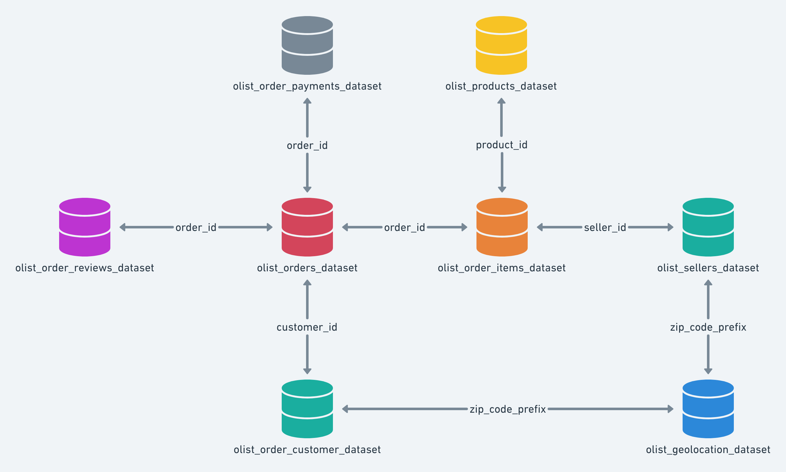

# E-Commerce-Sales-Customer-Analytics-SQL-Power-BI-
## Project Summary
This project analyzes an e-commerce transactional dataset to uncover insights related to sales performance, customer behavior, product demand, and delivery efficiency.

SQL was used to perform data validation, data modeling, and business analysis. Key analyses include calculating total revenue, monthly revenue trends, average order value (AOV), revenue by product category, repeat purchase rate, late delivery rate, and the relationship between delivery delays and customer review scores.

Customer behavior was further analyzed using RFM (Recency, Frequency, Monetary) segmentation. An RFM table was created and customers were scored using the NTILE function to classify them into different value segments.

Additional analyses include monthly order trends, category growth patterns, top-performing products, and seller performance.

Power BI was used to build an interactive dashboard that visualizes key business metrics such as total revenue, total orders, AOV, total customers, revenue by category, geographic sales distribution, repeat customer trends, RFM segmentation results, product performance, seller rankings, delivery delay distribution, and the relationship between delivery delays and customer satisfaction.

This project demonstrates common tasks performed by data analysts, including data preparation, SQL-based analysis, KPI development, customer segmentation, and business-focused dashboard creation.

## Business Problem
E-commerce companies rely heavily on data to monitor sales performance, understand customer behavior, and improve operational efficiency. However, large transactional datasets often contain complex relationships between customers, orders, products, sellers, and delivery processes.

The goal of this project is to analyze e-commerce data to answer key business questions such as:

• What are the main drivers of revenue growth?
• Which product categories generate the most sales?
• Which customers contribute the most revenue?
• How frequently do customers return to make additional purchases?
• Which products and sellers perform best?
• How does delivery performance impact customer satisfaction?

By combining SQL-based analysis with interactive Power BI dashboards, this project aims to transform raw transactional data into actionable insights that can support better business decision-making.

## Dataset Description

### Overview
This project utilizes the **Brazilian E-Commerce Public Dataset by Olist**. It contains real-world data from 100k+ orders placed between 2016 and 2018 across multiple marketplaces in Brazil.

The dataset provides a 360-degree view of an e-commerce ecosystem, covering customer behavior, seller performance, logistics, and product reviews.

[Download Project Dataset](Dataset/Dataset.zip)

---

### Dataset Tables

View Table Details (Customers, Orders, Products, etc.)

#### **customers**

| Column | Description |
| :--- | :--- |
| `customer_id` | Unique identifier for each order customer |
| `customer_unique_id` | Unique identifier for a customer across multiple orders |
| `customer_zip_code_prefix` | First 5 digits of customer zip code |
| `customer_city` | Customer city |
| `customer_state` | Customer state |

#### **geolocation**

| Column | Description |
| :--- | :--- |
| `geolocation_zip_code_prefix` | Zip code prefix |
| `geolocation_lat` | Latitude |
| `geolocation_lng` | Longitude |
| `geolocation_city` | City |
| `geolocation_state` | State |

#### **orders**

| Column | Description |
| :--- | :--- |
| `order_id` | Unique order identifier |
| `customer_id` | Reference to customer |
| `order_status` | Order status |
| `order_purchase_timestamp` | Purchase timestamp |
| `order_approved_at` | Payment approval timestamp |
| `order_delivered_carrier_date` | Date delivered to carrier |
| `order_delivered_customer_date` | Date delivered to customer |
| `order_estimated_delivery_date` | Estimated delivery date |

#### **order_items**

| Column | Description |
| :--- | :--- |
| `order_id` | Order identifier |
| `order_item_id` | Item number within the order |
| `product_id` | Product identifier |
| `seller_id` | Seller identifier |
| `shipping_limit_date` | Shipping deadline |
| `price` | Product price |
| `freight_value` | Shipping cost |

#### **order_payments**

| Column | Description |
| :--- | :--- |
| `order_id` | Order identifier |
| `payment_sequential` | Payment sequence number |
| `payment_type` | Payment method (Credit card, Boleto, etc.) |
| `payment_installments` | Number of installments |
| `payment_value` | Total payment amount |

#### **order_reviews**

| Column | Description |
| :--- | :--- |
| `review_id` | Review identifier |
| `order_id` | Order identifier |
| `review_score` | Customer rating (1–5) |
| `review_comment_title` | Review title |
| `review_comment_message` | Review message |
| `review_creation_date` | Date review created |
| `review_answer_timestamp` | Timestamp when review was answered |

#### **products**

| Column | Description |
| :--- | :--- |
| `product_id` | Product identifier |
| `product_category_name` | Product category |
| `product_name_lenght` | Length of product name |
| `product_description_lenght` | Length of product description |
| `product_photos_qty` | Number of product photos |
| `product_weight_g` | Product weight (grams) |
| `product_length_cm` | Product length (cm) |
| `product_height_cm` | Product height (cm) |
| `product_width_cm` | Product width (cm) |

#### **sellers**

| Column | Description |
| :--- | :--- |
| `seller_id` | Seller identifier |
| `seller_zip_code_prefix` | Seller zip code prefix |
| `seller_city` | Seller city |
| `seller_state` | Seller state |

#### **product_category_name_translation**

| Column | Description |
| :--- | :--- |
| `product_category_name` | Original Portuguese category |
| `product_category_name_english` | English translation |

---

### Data Model

The dataset follows a relational structure centered around the **orders** table, which serves as the central hub linking customers, items, payments, and reviews.

#### Key Relationships

*   **Orders**: `orders.customer_id` → `customers.customer_id`
*   **Order Details**: 
    *   `order_items.order_id` → `orders.order_id`
    *   `order_items.product_id` → `products.product_id`
    *   `order_items.seller_id` → `sellers.seller_id`
*   **Payments**: `order_payments.order_id` → `orders.order_id`
*   **Reviews**: `order_reviews.order_id` → `orders.order_id`
*   **Customer Location**: `customers.customer_zip_code_prefix` → `geolocation.geolocation_zip_code_prefix`
*   **Seller Location**: `sellers.seller_zip_code_prefix` → `geolocation.geolocation_zip_code_prefix`
*   **Product Categories**: `products.product_category_name` → `product_category_name_translation.product_category_name`

#### Central Fact Table
The `orders` table acts as the **central fact table**, connecting customer demographics, transaction details, product data, and seller information. 

This schema enables deep-dive analysis into:
*   **Customer Behavior**: Purchasing patterns and frequency.
*   **Seller Performance**: Revenue generation and fulfillment.
*   **Product Insights**: Category-level sales and trends.
*   **Logistics**: Delivery performance and estimated vs. actual arrival times.
*   **Finance**: Payment method preferences and installment trends.
*   **Geography**: Sales distribution across Brazilian states.
